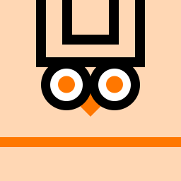

<p align="center">
  
</p>

# Matchowl

A football prediction game for you and your friends. Predict the whole
tournament up front, tip every individual match, and compete on private
leaderboards. Ships as a **single Docker image** (one Go binary serving the
API and the embedded SvelteKit app).

> Naming note: **Matchowl** is the successor of **WM Tips**, the World Cup
> 2026 prediction game (archived at [`wm-pickems`](https://github.com/floholz/wm-pickems)).
> The WC 2026 data lives on inside Matchowl as its first (archived)
> tournament.

Matchowl is **multi-tournament**: tournaments are records, not code. Each one
carries its structure (stages, group shape, qualifier rules) and results-sync
config as data, so a Euro, a World Cup, or a straight-knockout cup can be
added from the admin API without touching the codebase (see
[`docs/plans/03-matchowl-rework.md`](docs/plans/03-matchowl-rework.md)).

## Features

- **Tips** — predict the score of every match of the tournament. Editable
  until kickoff; knockout entry is progressive (90′ → extra time → penalty
  winner). You can see which friends have tipped; after kickoff your tip locks
  and their picks are revealed.
- **Forecast** — one pre-tournament call: full group standings, any
  extra qualifiers (WC2026: the 8 best thirds), and the whole knockout
  bracket. Locks at the
  first kickoff; correctness is shown per stage as results come in
  (exact / advanced-but-wrong-slot / missed).
- **Leagues** — private competitions you join via invite code or a
  shareable `/join/<code>` link (with public preview + auth resume).
  Combined leaderboard plus separate **Overall / Tips / Forecast** views,
  with the tiebreaker stats exposed and a built-in scoring legend. Your
  own row is highlighted. Every user is auto-joined to a shared **Global**
  league.
- **Live tournament view** — group tables and a knockout bracket that fill
  in from real results.
- **Bot opponents** — `role=bot` accounts that play your leagues through the
  public API under the exact same locks as humans. Two brains: a deterministic
  API-free **rating model** (`algo`) or **Claude** (`claude`). They run as a
  standalone side project ([`bots/`](bots/README.md)) and revise their
  predictions from results as the tournament unfolds.
- **Accounts** — email/password with **password reset** (forgot-password +
  in-app confirm route), **Google sign-in** (OAuth2, configured from env),
  and a **settings page** to edit display name and avatar.
- **PWA** — installable (topbar button + first-visit banner on mobile),
  offline app shell, maskable icons + screenshots.
- **Results** — auto-synced from API-Football (free tier) when a key is set;
  always overridable by an admin; fully playable on the seeded fixtures
  without any key.

## Scoring (config-driven, max 7 points per match)

| Per match | Pts |
|---|---|
| Correct result — group `1/X/2`; knockout: the team that advances | 3 |
| Correct goal difference | +1 |
| Exact score | +3 |

A perfect tip scores 7, the right result with the right margin 4, the
result alone 3. (The WC26 rules also paid +1 for the total goals; it was
dropped on 2026-09-13 — the config still supports it.)

Knockout games have no draw; the score points use the after-extra-time score
when a tie goes to extra time.

**Forecast:** each team in its correct final group position `1` (whole group
perfect `+2`); `+1` per predicted advancer (group top-2 or a best-third pick)
that actually advances; escalating knockout reach per predicted team —
R32 `1` / R16 `2` / QF `3` / SF `5` / Final `8` / Champion `13`.

**Tiebreakers:** points → most exact scores → most correct winners → smaller
goal-difference error → fewer tips submitted → earliest submission. Users
who never submitted a tip are sorted to the bottom regardless.

Every weight lives in the `scoring_configs` "Default" record (per-League
overrides supported) and can be changed without a redeploy — the in-app
legend always reflects the live config.

## Stack

- **Backend** — Go with [PocketBase](https://pocketbase.io) as a framework
  (auth, SQLite, REST, cron, hooks).
- **Frontend** — SvelteKit SPA (`adapter-static`, Svelte 5), bundled into the
  Go binary via `go:embed`.
- **Ship** — one multistage Docker image; SQLite data on a `pb_data` volume.

## Project layout

```
main.go                 wiring: migrations, seed, route registration, SPA serve
migrations/             Go-code PocketBase schema + data migrations
internal/
  seed/                 embedded openfootball WC2026 data + first-boot seed
  football/             API-Football client
  sync/                 result sync, manual override, bracket resolver
  tips/                 per-match tip rules (lock, KO, friends endpoint)
  forecast/             forecast validation + structure endpoint
  scoring/              pure scoring core, recompute, leaderboard (+ tests)
  leagues/              create / join / leaderboard endpoints
  bracket/              FIFA Annex C best-third → R32 allocation table
  oauth/                Google sign-in wiring from env (idempotent)
  clock/                overridable "now" (dev virtual clock)
  dev/                  MATCHOWL_DEV-only simulator + bot generator
  web/                  go:embed of the built SPAs (app + admin)
frontend/               SvelteKit app (players; PWA)
admin/                  SvelteKit admin app, desktop-first, served on the admin host
bots/                   standalone bot player (algo / Claude) — own Go module
```

## Develop

```sh
make install        # frontend + admin deps
make dev-backend    # PocketBase on http://127.0.0.1:8090 (PocketBase UI at /_/)
make dev-frontend   # the app's dev server on :5173 (proxies /api to the backend)
make dev-admin      # the admin app's dev server on :5174 (same proxy)
```

The admin app (competitions, sync, people, announcements, notifications, dev harness) is its own
SPA with its own sign-in — an account with role `admin` or `owner`. The
binary serves it by host: `admin.<app host>` (see `ADMIN_URL` in
[DEPLOY.md](DEPLOY.md)); with a single local binary that is
`http://admin.localhost:8090`. Set `ADMIN_URL=http://localhost:5174` in
`.env` while developing so the app's user menu links to the dev server.

## Build & run as a single binary

```sh
make run            # builds both SPAs, embeds them, runs the binary
```

App + API are served from one origin on `:8090`; the admin app answers on
`http://admin.localhost:8090`.

## Test

```sh
make test           # Go unit tests (scoring engine)
```

The frontends type-check with `npm run check` in `frontend/` and `admin/`.

## Docker / deploy

```sh
cp .env.example .env       # API_FOOTBALL_KEY, admin creds, port
docker compose up --build -d
```

Full operations guide (superuser, results override, recompute, backup, TLS):
see [DEPLOY.md](DEPLOY.md).

## Dev / test harness

Run with `MATCHOWL_DEV=1` to unlock the **Dev** page of the admin app:

- **Advance** to any timestamp — matches before it are simulated finished
  (mid-match → live, not scored), later ones reset; the virtual clock drives
  every lock/visibility rule so you can test the whole lifecycle.
- **Generate bot players** — full random Forecast + a tip on every match,
  joined to your leagues, for instant leaderboard testing.
- **Reset** — clear all results and the clock.

The dev endpoints are **not registered** unless `MATCHOWL_DEV=1`.

## Data

- Fixtures/teams/groups seeded from
  [openfootball/worldcup.json](https://github.com/openfootball/worldcup.json)
  (embedded, public domain).
- Live results from [API-Football](https://www.api-football.com) free tier
  (one request per sync, well under the daily limit).

## Roadmap / known follow-ups

[PLAN.md](PLAN.md) is the living project plan — current state, the app-wide
validation walkthrough, and the backlog. Historical implementation plans are
archived in [docs/plans/](docs/plans/README.md).

## License

See [LICENSE](LICENSE).
